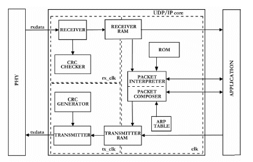

# UDP/IP Implementation

There are a few critical sub-modules that make up a typical UDP/IP core (seen below):

Receiver: detects new packets and checks CRC as well as destination MAC-address, discarding the packet if either check fails

CRC checker:  calculates the cyclic redundancy check, an error-detecting code commonly used to check for accidental changes in raw data

Receiver RAM: temporarily stores the entire packet, bad CRC’s and MAC-addresses are filtered out in the receiver

ROM: non-changing control values are stored here to save space

Packet Composer/Interpreter: the main UDP control block, which manages incoming and outgoing packets, validating UDP packets as well as managing ARP and ICMP requests and responses

Address Resolution Protocol: Stores IP and MAC addresses for reference

Transmitter RAM: temporarily stores entire packet before transmitting

Transmitter: sends the generated packet along with the calculated CRC that is appended at the end

In my version of UDP/IP, some novel design decisions were made to make success more achievable. Most significantly, I 
decided not to integrate an ARP Table into the project. I considered the interesting part of this project to be the 
development and iteration of a packet validation protocol. By removing some of the complexity of fully realizing the 
UDP/IP protocol, I gave myself more time to iterate on and optimize my design. In addition, some sacrifices were made 
in the durability of the design. For example, I did not include a ring buffer full detector to indicate when the ring 
buffer is full. For this reason, there are strict requirements on the size and frequency of communication for the 
udp/ip receiver and transmitter to remain in operation. Despite these design decisions that reduce the usability of 
the final product, it would be fairly straight forward to produce something better now with a working full-pipeline 
design.

## [Index](index.md)
