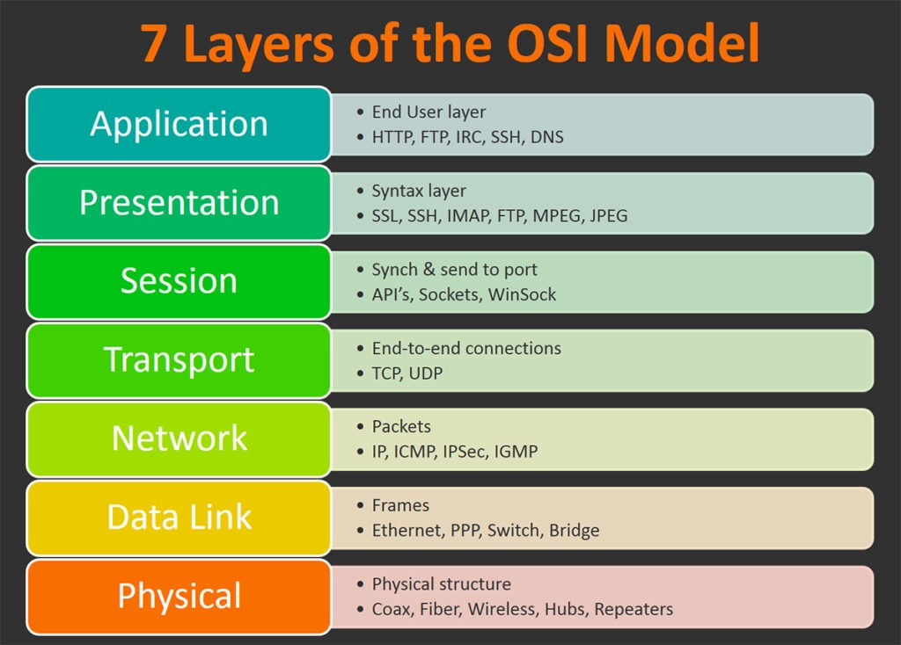
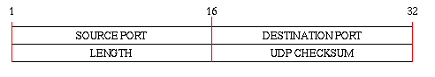

# UDP/IP Overview

To understand Ethernet communications protocols such as UDP, it is important to understand how network communications 
design is abstracted. The open system interconnection (OSI) model, the primary recognized model, divides network 
communications into seven different layers. Layers one through four, physical, data link, network, and transport, are 
lower level, meaning they are mostly concerned with moving data around. The physical layer conveys the actual bit 
stream. The data link layer, which includes media access control (MAC) and logical link control (LLC), handles low 
level packet flow. The MAC controls how the network gains access to data and the LLC handles frame synchronization as
well as low-level flow control. Also, the network layer provides the actual routing and switching involved in 
transmitting data from node to node. In addition, the transport layer provides transparent transfer of data between 
end systems. Layers five through seven, session, presentation, and application, are higher level, meaning they contain
application-level data. The session layer establishes, manages, and terminates connections between applications. The 
presentation layer translates network data into a format that can be accepted and understood by the application. 
Finally, the application layer includes everything specific to the actual application.

User Datagram Protocol (UDP) is a very thin Ethernet protocol built on top of the internet protocol (IP), that I will 
be implementing over the course of this project. It is an end-to-end protocol in that it contains enough information 
to transfer a user datagram from one process on the transmitting host to another process on the receiving host. UDP is
used when reliable delivery is not required, because unlike TCP, which is the other common Ethernet protocol, there is
no required acknowledgement of packet reception. As a result, UDP makes no guarantee that the transmitted data will be
received properly by the end system. Applications that would benefit from a protocol designed this way value 
communication speed over reliability of data. For example, streaming media commonly uses UDP because speed of 
communication is far more important than the accuracy of the data itself.

As a result of the reduced connection and error checking, a UDP packet (shown below) is much smaller than a TCP packet.
Computers use ports (16 bit field) to identify the specific application that a network connection is accessing. Within
a UDP packet, the source port is the port number used by the source host while the destination port is the port number
used by the end application. Checksum is optional in UDP, with the field set to zero if intended to be unused. It is 
notable that the UDP protocol appends a 12-byte pseudo header with IP addresses of source and destination as well as a
few other additional fields. The receiving host appends its own IP address with the source IP address in the same way 
before checking to see if the checksum matches. If it does, the receiving application knows the message has reached 
its destination.

Network communications projects can span all seven of the OSI layers, but Ethernet protocols are usually implemented 
in transport, network, and data link layers. For the purposes of this project, we primarily care about implementing 
UDP (transport layer) and IP (network layer), where UDP handles end to end communication and IP handles the actual 
routing and switching of the message. 

An early design consideration in implementing UDP/IP is whether to build the communication protocol in a 
microprocessor or an FPGA. Although FPGAs are faster and have a higher bandwidth, it is sometimes impractical either
for size, design, or cost requirements to fully implement in hardware. In this case, UDP/IP is commonly implemented 
completely within hardware because of how simple it is. However, UDP/IP modules interact with other modules that are
implemented in software such as any application layer systems. In addition, TCP/IP is usually partially implemented 
in software because of how complicated the error and connection is. In this case, although the underlying internet 
protocol is probably still built on an FPGA, the actual transport layer TCP module is design on a microprocessor.
