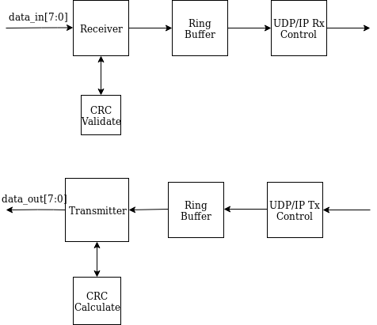

# Test Strategy

I used an incremental design validation strategy to confirm the functionality of my UDP/IP receiver and transmitter. 
For each separate module that was designed, I developed a test bench that was specifically designed to confirm the 
functionality of that module. For some of these modules, I broke out internal control signals to confirm the state 
changes within the module. With all of the modules separately confirmed, I gradually connected them while testing each
incremental version until everything was connected. First I connected and tested the crc receiver/transmitter and ring
buffer. Following this, I connected the actual UDP control module to the ring buffer and tested the complete 
transmitter on its own. Finally, I confirmed the full receiver by connecting it to the transmitter. With a confirmed 
ability to input data to the transmitter and receive it correctly at the output of the receiver, I was satisfied with 
the functionality of the full design.

Upon reflection, this test strategy was much more effective than test strategies I have used in the past. In the past,
I have started by testing the top-level design, before digging into the details of the modules that make up this 
top-level design if the top-level testbench does not produce the desired results. This strategy would draw out testing
because any debugging would have to be done top down, gradually exploring sub-modules to find where problems might 
lie. The iterative test strategy I utilized here confirmed that the lower level sub-modules were operational before 
confirming the top-level design. To others considering large-scale FPGA development, I would strongly recommend this 
strategy. Although it involves more work up front in order to confirm the design, it also simplifies the debugging 
process by guaranteeing that you will never have to solve more than just a straightforward problem. Furthermore, it is
critical to fully consider a test strategy before beginning to debug and confirm a design, especially an involved 
design that is made up of a lot of moving pieces. 

## [Index](index.md)
